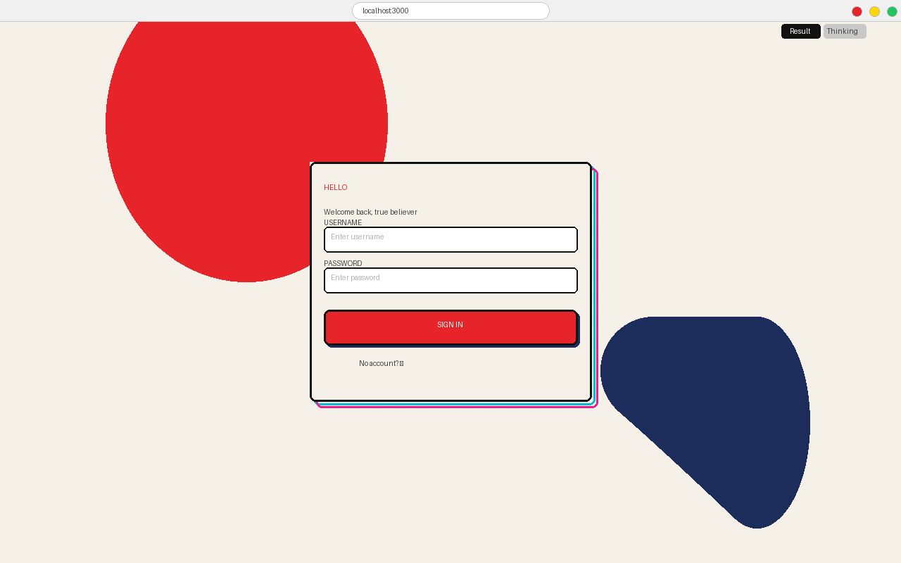
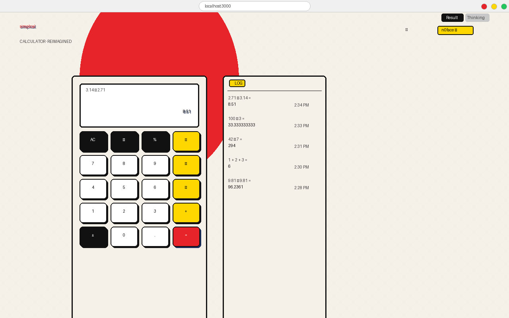
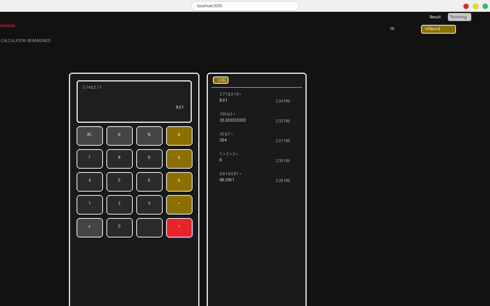

<p align="center">
  <picture>
    <source srcset="packages/console/app/src/asset/logo-ornate-dark.svg" media="(prefers-color-scheme: dark)">
    <source srcset="packages/console/app/src/asset/logo-ornate-light.svg" media="(prefers-color-scheme: light)">
    
  </picture>
</p>
<p align="center"><strong>n0face's OpenCode Fork</strong> — AI coding agent with custom modes, mascot, and project tools.</p>

---

## One-Command Install

```bash
curl -fsSL https://raw.githubusercontent.com/n0facearia/n0face-opencode-fork/main/install.sh | bash
```

Installs 3 custom agent modes (design, cleanup, security), system prompts, and configs — then press **Tab** to cycle through all 5 modes.

## One-Command Uninstall

```bash
curl -fsSL https://raw.githubusercontent.com/n0facearia/n0face-opencode-fork/main/install.sh | bash -s -- --uninstall
```

---

## What's Different From OpenCode

| Feature | OpenCode | This Fork |
|---------|----------|-----------|
| **Agent modes** | plan, build | plan, build, **design, cleanup, security** |
| **TUI Mascot** | None | Animated cat sprites |
| **Message tabs** | None | Result / Thinking toggle |
| **Home screen** | Single column | Three-column layout |
| **Mode prompts** | 2 built-in | 5 modes with system prompts |
| **Setup commands** | None | `/new-project`, `/import-md` |
| **Config isolation** | Shares `.opencode/` | Uses separate `.n0face/` dir |
| **Install** | `curl opencode.ai/install` | `curl raw.githubusercontent.com/...` |

### Custom Agents

| Agent | Color | Purpose |
|-------|-------|---------|
| **design** | Purple `#A855F7` | UI/UX audit, accessibility, animations |
| **cleanup** | Green `#22C55E` | Code quality, dead code, performance |
| **security** | Red `#EF4444` | Vulnerability scan, dependency audit |

---

## Quick Start

### Install the mode system (in any project)

```bash
curl -fsSL https://raw.githubusercontent.com/n0facearia/n0face-opencode-fork/main/install.sh | bash
```

### Run n0face

```bash
n0face
```

### Switch modes

Press **Tab** to cycle: `plan` → `build` → `design` → `cleanup` → `security`

### Create a new project

```
/new-project
```

Scaffolds a new project with the full mode system. Prompts for project name, type, stack, and description, then creates `PROJECT_SUMMARY.md`, `MODE_CONTEXT.md`, and `.n0face/`. Opens in VS Code if running inside it.

### Import into existing project

```
/import-md
```

Scans an existing project and imports the mode system without overwriting existing files. Auto-detects project name, type, and stack from `package.json`, `Cargo.toml`, `go.mod`, or `README.md`. Creates `PROJECT_SUMMARY.md`, `MODE_CONTEXT.md`, and `.n0face/` wherever they're missing.

---

## Demo Project: simpl·cal

A full Spider-Verse themed calculator built entirely with n0face — from design system to deployed app. Shows all 5 modes in action.

**Repo:** https://github.com/n0facearia/simpl-cal

### Prompts Used

**`plan` mode** — Architecture & stack decision:
```
Build a Spider-Verse themed calculator app with Next.js.
Theme: halftone dots, CMYK misregistered shadows, bold comic-style borders.
Palette: #e62429 red, #00bcd4 cyan, #e91e90 magenta, #ffd700 yellow, #111 ink.
Features: basic arithmetic, expression history, dark mode toggle, localStorage persistence.
```

**`build` mode** — Core implementation:
```
Scaffold Next.js app with halftone CSS background using radial-gradient dots.
Build the calculator component with 3D-styled buttons, display with expression + result.
Add history panel with timestamped calculations. Implement dark mode via CSS variables.
Add favicon, manifest.json, and PWA support with Spider-Verse icon design.
```

**`design` mode** — Visual polish:
```
Run full UI audit on the calculator. Add comic card rounded borders with 3px black outline.
Implement misregistered CMYK shadow effect (cyan + magenta offset) on cards and buttons.
Add halftone dot overlay on calculator display area. Make buttons have 3D press depth.
Add Spider-Verse color splash blobs in the background. Design Spider-Verse favicon with
equal sign in red, misregistered cyan/magenta offsets, halftone dots.
```

**`cleanup` mode** — Refinement:
```
Run code cleanup on the project. Remove unused imports, consolidate CSS variables.
Optimize the halftone background rendering. Fix button sizing inconsistencies.
```

**`security` mode** — Audit:
```
Run security audit. Check for eval() in expression parser, verify localStorage usage
is safe, review dependencies for vulnerabilities.
```

### Screenshots

**Login Page** — Spider-Verse themed auth card with misregistered CMYK shadows:



**Calculator Home (Light)** — Full calculator with expression display, 3D buttons, and history panel:



**Dark Theme** — Full dark mode with comic-style dark cards and yellow-accented operator buttons:



### Modes Used

| Mode | What it did |
|------|-------------|
| **plan** | Architecture, stack selection (Next.js), component layout, theme strategy |
| **build** | Scaffolding, calculator logic, history, dark mode, PWA setup, favicon |
| **design** | Halftone CSS, CMYK misregistration, 3D buttons, color splashes, favicon design |
| **cleanup** | Code organization, CSS variable consolidation, rendering optimization |
| **security** | eval() audit, localStorage safety check, dependency review |

---

## Separate from OpenCode

Running `n0face` uses its own config directory and never touches `.opencode/`:

| | `n0face` | `opencode` |
|---|---|---|
| **Project config dir** | `.n0face/` | `.opencode/` |
| **Project config file** | `n0face.json` / `n0face.jsonc` | `opencode.json` / `opencode.jsonc` |
| **Global config dir** | `~/.config/n0face/` | `~/.config/opencode/` |
| **Agent files** | `.n0face/agent/*.md` | `.opencode/agent/*.md` |
| **Command files** | `.n0face/command/*.md` | `.opencode/command/*.md` |

This means you can have **both `n0face` and `opencode` installed side by side** without interference. The install script only creates files under `.n0face/`.

---

## Manual Install (Full Fork)

For the TUI customizations too (mascot, tabbed views, home screen):

```bash
git clone https://github.com/n0facearia/n0face-opencode-fork.git
cd n0face-opencode-fork/packages/opencode
npm i -g bun
bun install
bun run build
```

Then `n0face` is available anywhere.

---

## The Mascot

The cat sprite changes based on the agent's state:

| State | Eyes | What's happening |
|-------|------|------------------|
| **idle** | `~ _ ~` | Waiting for your input |
| **thinking** | `^ _ ^` | Model is streaming or executing tools |
| **planning** | `███` | Plan mode is active |

---

## File Structure

```
.n0face/                        # Mode system prompts
├── design.mode.md              # Design audit checklist and workflow
├── cleanup.mode.md             # Code quality audit checklist and workflow
└── security.mode.md            # Security audit checklist and workflow

.n0face/agent/                  # Agent configurations
├── design.md                   # Design agent (mode: primary)
├── cleanup.md                  # Cleanup agent (mode: primary)
└── security.md                 # Security agent (mode: primary)

.n0face/command/                # Custom slash commands
├── new-project.md              # /new-project — scaffold a new project
└── import-md.md                # /import-md — import into existing project

TUTORIAL.md                     # Full guide with mode commands and references
install.sh                      # One-command install script
```

---

## Credits

This is a feature fork of [OpenCode](https://github.com/sst/opencode) — the open source AI coding agent by [SST](https://sst.dev).

---

<p align="center">
  <a href="TUTORIAL.md">Full Tutorial →</a>
</p>
